# I-CUBE-CoreMark

## Introduction
I-CUBE-CoreMark is a helper which generats CoreMark project over STM32 with only few clicks in STM32CubeMX. 

CoreMark source code (v1.01) used by I-CUBE-CoreMark is originally from:
https://github.com/eembc/coremark

## Development Environment
I-CUBE-CubeMark pack is developed by **STM32PackCreator** 3.4.0 (compliant with CMSIS-Pack v1.6.3) w/ reference **UM2739: How to create a software pack enhanced for STM32CubeMX using STM32 Pack Creator tool**

## Test Environment
The following tools and boards are used during test:
- STM32CubeMX v6.5.0
- STM32CubeIDE v1.9.0
- IAR EWARM v9.10.2
- Keil MDK v5.36

- NUCLEO-U575ZI-Q
- STM32F746G-DISCO
- NUCLEO-L412RB-P

##Timer Settings for CoreMark
The settings of timer used by CoreMark is mostly managed in core_portme.c. Here are the key adoptions done by the pack:
- `#define NSECS_PER_SEC SYSTICK_CLOCK`
where SYSTICK_CLOCK = HCLK configured in Clock Configuration in CubeMX.
- `#define TIMER_RES_DIVIDER (SYSTICK_CLOCK/1000)`
based on the fact that the default HAL tick (or SysTick) is 1000 Hz.
- Global **uwTick** managed by CubeHAL is used by start_timer() and stop_time() in core_portme.c

##Usage
#### 1. Download I-CUBE-CoreMark from Github
1. Click the latest release from "Releases":
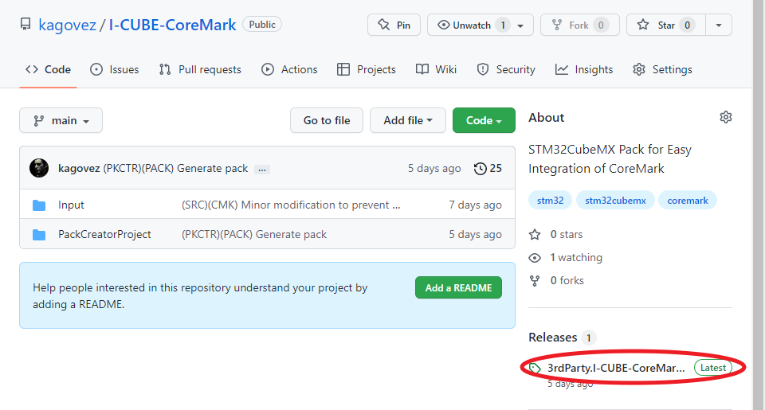
2. Download "3rdParty.I-CUBE-CoreMark.x.x.x.pack":
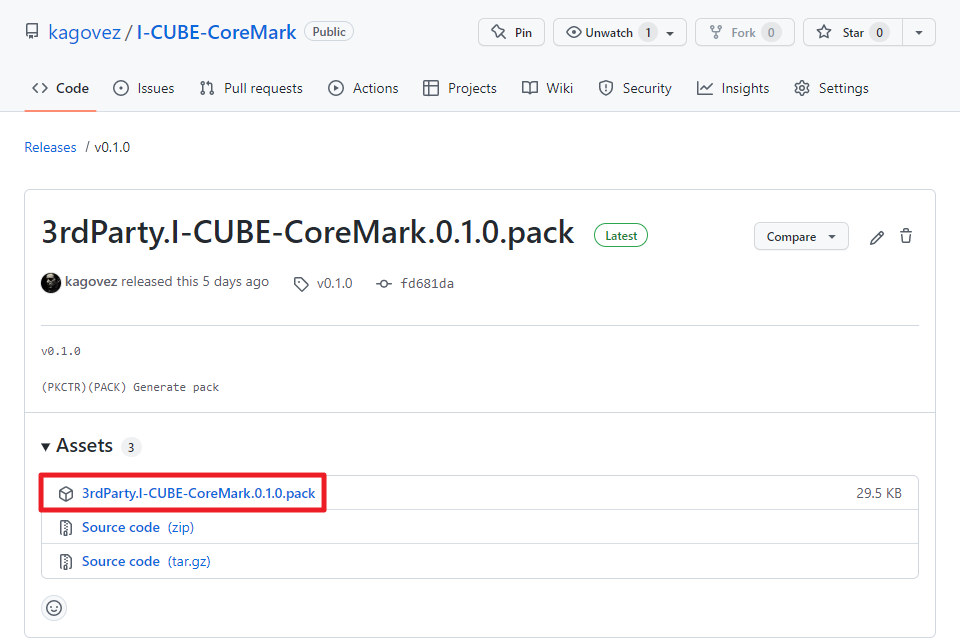
#### 2. Install I-CUBE-CoreMark pack from STM32CubeMX
1. In STM32CubeMX, click **Help --> Manage embedded software packages**:

2. Click button "From Local" on the bottom right:

3. Assign the path of downloaded 3rdParty.I-CUBE-CoreMark.x.x.x.pack:
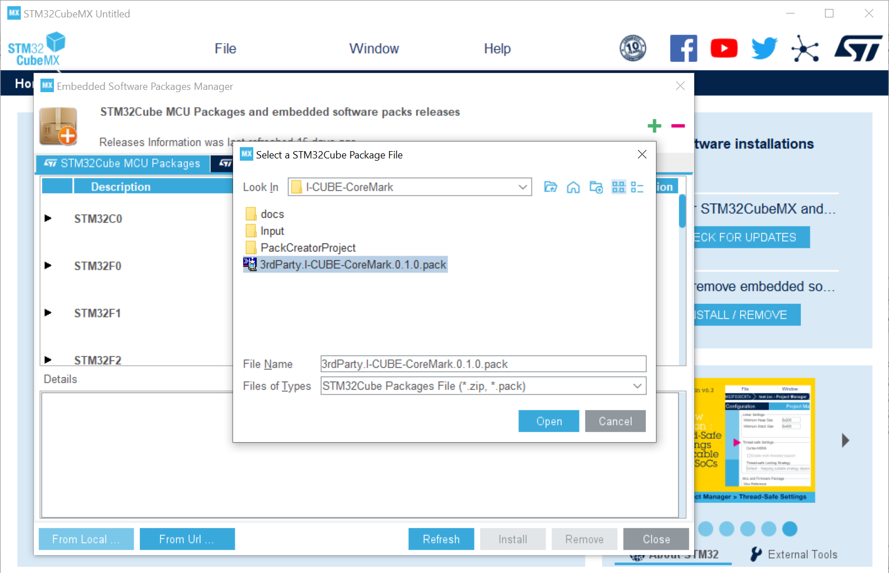
4. After installation, I-CUBE-CoreMark marked in green should be seen in "Embedded Software Packages Manager":

#### 3. Enable/Configure UART for report output

#### 4. Enable/Configure I-CUBE-CoreMark
1. Click **Software Packs --> Select Components**:

2. Select and expand the latest version of "3rdParty.I-CUBE-CoreMark" and select "CoreMarkApp" in Application w/ Utility MISC checked:

3. After expanding "Software Packs" to select 3rdParty.I-CUBE-CoreMark.x.x.x, checked "Utility MISC" and "Device Application" in Mode, and then assign "CoreMark Iteration" and "UART Port for printf" in Configuration::Parameter Settings:
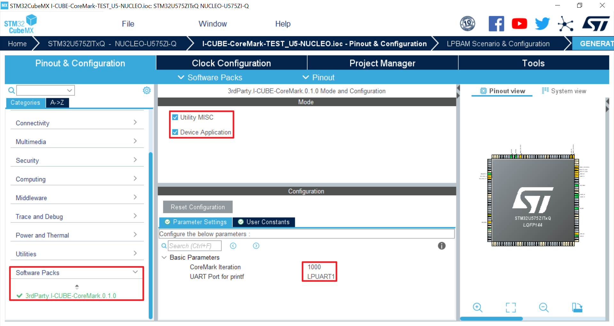
NOTE: The assignmment in "UART Port for printf" needs to be matched with the UART port for report output assigned in Step 3.
#### 5. Generate Code from STM32CubeMX
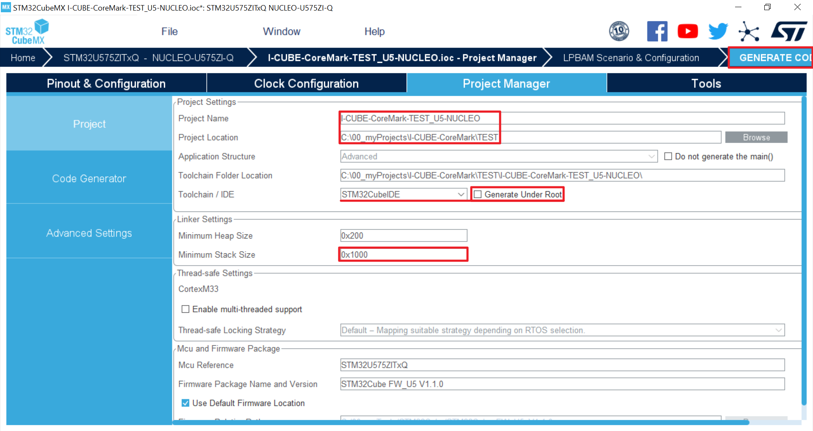
In "Project Manager" tab:
1. Assign proper project name along with project Location.
2. Toolchain/IDE
Choose preferred Toolchain/IDE from Project Manager. It is suggested to UNCHKECK "Generate Under Root" for STM32CubeIDE (as shown in the picture above) if multiple IDEs will be used.
3. Stack Size
Default 0x400 works fine for STM32CubeIDE.But for EWARM and MDK, it is suggested to set ==0x1000== to prevent possible HardFault. 
4. Press "GENERATE CODE" button
#### 6. Open/Compile CoreMark project from IDE
Open CoreMark project with preferred IDE to build/compile it. 
1. There should be no compiling error/warning for EWARM and MDK, but will be a minor compiling warning in STM32CubeIDE as shown below:

2. If compiling error as shown below occurs (taking STM32CubeIDE for example, undefined reference to huart1 ): 

it is duo to the mismatch of UART port setting between Connectivity and I-CUBE-CoreMark. For example, LPUART1 is enabled for report output: 

But the default U(S)ART1 is used in I-CUBE-CoreMark:

#### 7. Program/Execute CoreMark project
- Program
- UART terminal settings
    - Baud rate needs to be aligned with the settings in step 2 such as ==TODO==
    - Newline of receiving: LF (as shown below)
      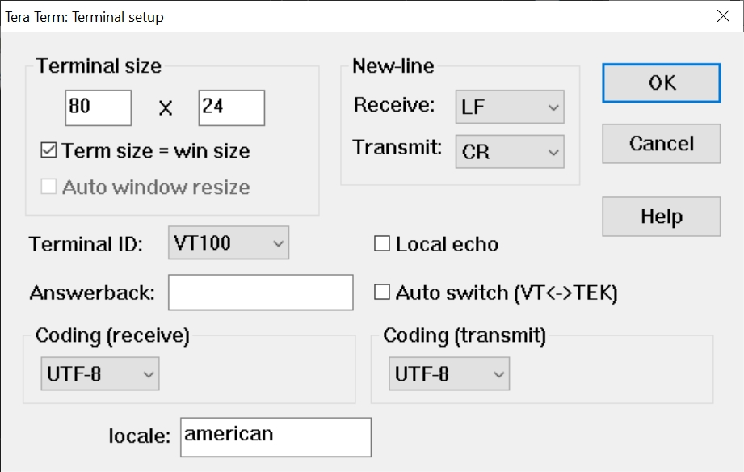
- Execution
The following is the test result of STM32F746 whose official CoreMark score is 1082:
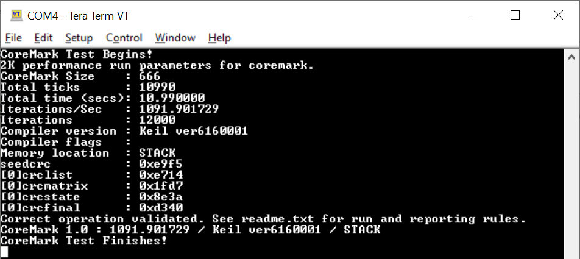
    
#### 8. Situatioins
1.  Compiling error, for example: missing symbol for huart1
Explained in 6.2 above
2.	No output at all
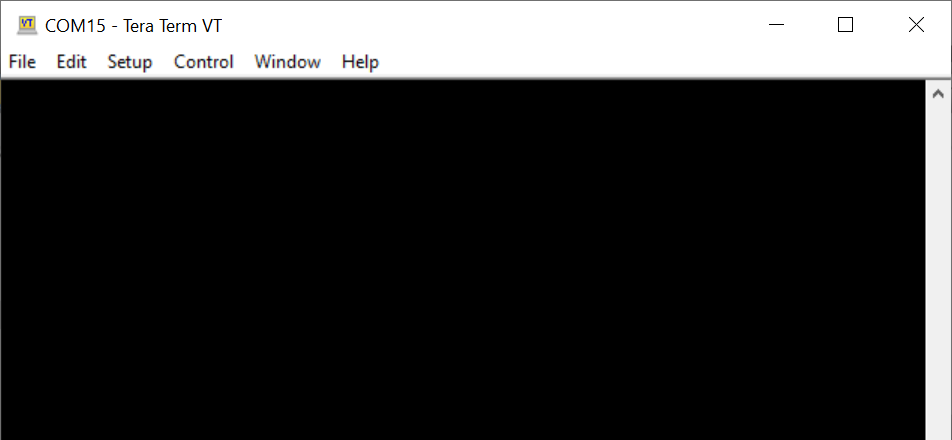
3.	Output with only one line

4.	Complete test report with ERROR (less than 10 secs)
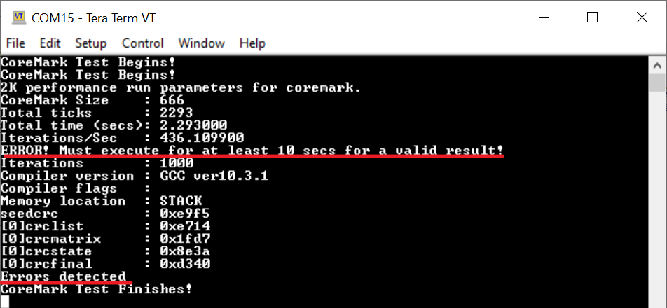
Please increase "CoreMark Iteration" in I-CUBE-CoreMark to make CoreMark execute more than 10 secs:
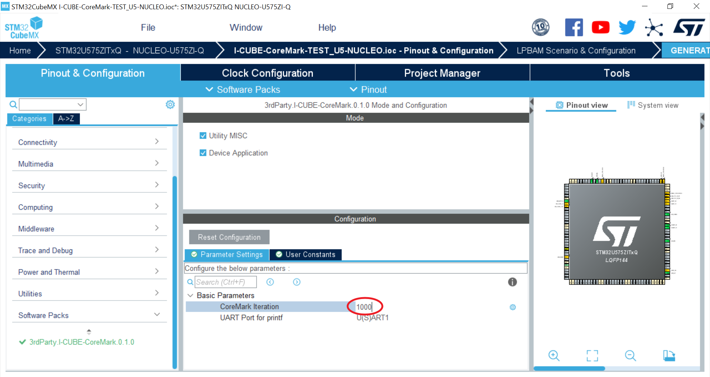
5.	Complete test report w/o time value and score (only in STM32CubeIDE):

Please check if -u _printf_float is enabled as shown below:
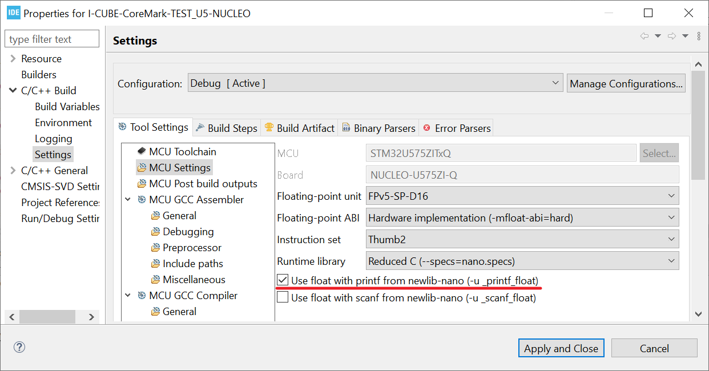
6.	Score is too low 
Please check if HCLK is set to maximum in clock configuration. And if performance accelerators are enabled.

